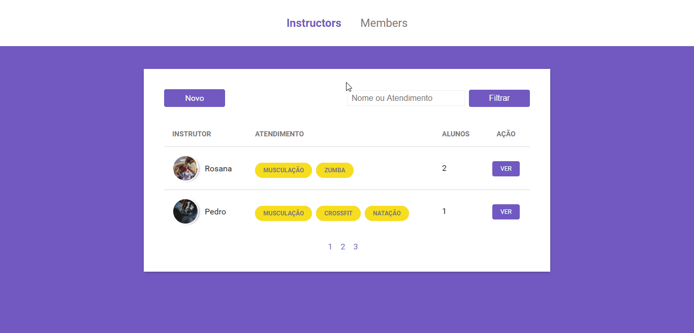

<h1 align="center">Gym Manager</h1>

Gym management system built during Rocketseat bootcamp.

    

## Built With
- [Node.js](https://nodejs.org/en/)
- [PostgreSQL](https://www.postgresql.org/)

## Installing
These instructions will get you a copy of the project up and running on your local machine for development purposes.

1. Clone this repository by running:   `git clone https://github.com/caiquegiovannini/gym-manager.git`;
2. Enter the folder running through the terminal: `cd gym-manager`;
3. Run `npm install` to install the project dependencies;
4. Run `npm start` to start the development server.

## License
This project is licensed under the MIT License - see the [LICENSE](LICENSE) file for details.

